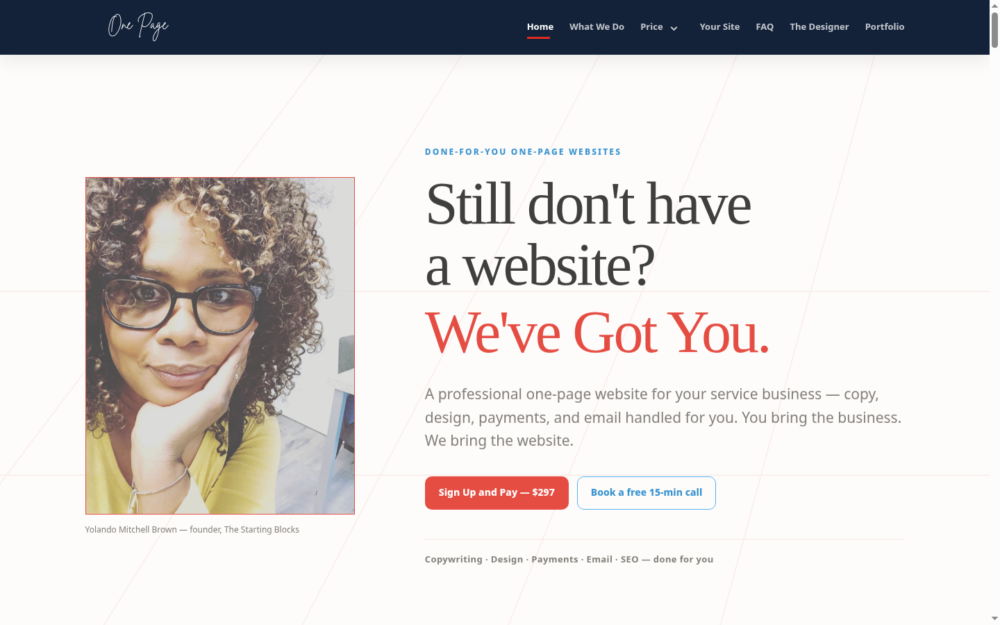

# The Starting Blocks — Redesign Draft

> A full redesign draft of **thestartingblocks.com** — Yolando Mitchell Brown's done-for-you one-page website service for service-based businesses.

[](https://agentzlab.github.io/TheStartingBlocks-Remake/)
[](https://github.com/agentzlab/TheStartingBlocks-Remake/commits/main)
[](https://github.com/agentzlab/TheStartingBlocks-Remake)
[](https://agentzlab.github.io/TheStartingBlocks-Remake/)
[](https://agentzlab.github.io/TheStartingBlocks-Remake/)

**Live preview:** https://agentzlab.github.io/TheStartingBlocks-Remake/



## What's inside

- Sticky nav with her red script **logo** (ChatGPT-generated) + her exact 7 labels (Home, What We Do, Price, Your Site, FAQ, The Designer, Portfolio) + Price dropdown + mobile slide-in menu with hairline dividers
- Hero: "Still don't have a website? We've Got You." with a warm lifestyle image and the caption "Your website, done for you."
- First video (Vimeo) + her six service descriptions, word-for-word, with her bold/red emphasis
- "Let's Talk About Your Business" — her full pitch section from the live site
- Five-step process (Sign Up and Pay → One on One Consulting → Website Prep Form → Community Group → Show Up and Finish) with a video-call image beside the consulting step
- Pricing matching her real setup: **$297 light card** / **$157 dark featured card**, full feature copy, real PayPal + Stripe checkout links, production-queue Important Note
- "Your Journey" — a four-tab interface (Who This Is For / What's Included / What Your Site Will Have / What You'll Walk Away With) with elegant red check circles
- "What We've Built" — horizontal scroll-snap project showcase (9 projects, real links)
- Testimonials with a "Read more" lightbox: full text, prev/next arrows, position counter
- "How I Got My Start" founder video — cleaned custom thumbnail, subtle 8px radius, click-to-play YouTube
- About: Yolando's yellow-shirt portrait + "I Was My First Client" + Google reviews link
- FAQ, contact with real email + free 15-min call CTA, back-to-top button that fades in on scroll
- Uniform subtle 10px corner radius across all images and cards

## Design language

- Warm light background, near-black text
- Red primary `#E02B20` (buttons `#ff0000`), blue secondary `#2EA3F2`
- Deep navy `#0B1B33` for nav menu + portfolio/pricing feature surfaces
- **Prata** serif headings + **Roboto** body — her actual brand fonts (+ Allura script accent)
- Her emoji icon language (🎯 💥 💻 🔒 …), used deliberately

## Tech stack

| Layer | Choice |
|---|---|
| Page | Single self-contained `index.html` (exported from the Muse web-artifact build) |
| Fonts | Google Fonts: Prata + Roboto + Allura |
| Video | YouTube + Vimeo embeds (click-to-play posters) |
| Checkout | PayPal + Stripe payment links (her real ones) |
| Hosting | GitHub Pages from `main`, no build step |

## Project structure

```
├── index.html                  # the site (self-contained)
├── assets/
│   ├── screenshot.png          # README hero + link-preview image (refresh on every build change)
│   ├── yolando-portrait.jpg    # founder portrait (About section)
│   └── img/                    # lifestyle, audience, video posters, ChatGPT imagery, logo
├── docs/
│   ├── CURSOR-BLUEPRINT.md     # builder briefing for future work
│   ├── audit.md                # source-site audit + resolved contradictions
│   ├── context-block.md
│   ├── decision-log.md         # every design decision, dated
│   └── prebuild-readouts.md
├── .nojekyll
└── README.md
```

## Workflow

- `main` = the live preview. Nothing here touches the live WordPress site or goes to Yolando until Jon approves.
- Screenshots refresh on every build change — no stale screenshots.
